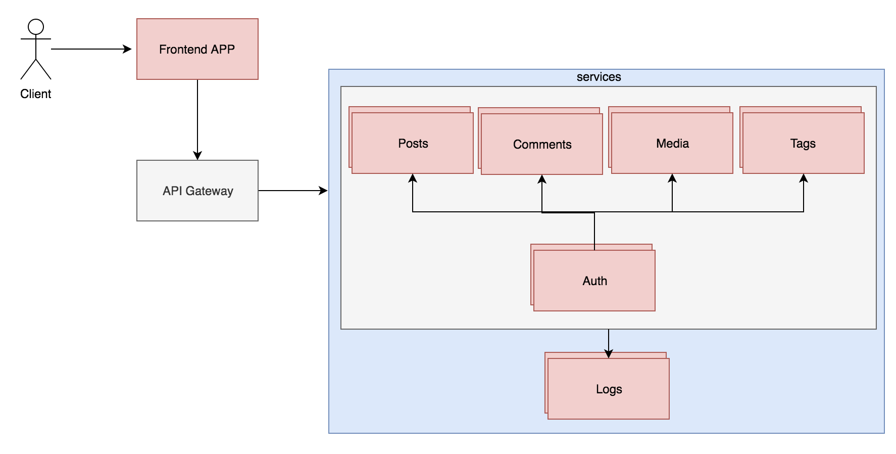

# Microservices 
The purpose of this repo is to create a simple microservice blog.

currenlty the plan is to develop everything in Golang as a practice for me to solve different problems or implement new things.

# Service Design
 

# Todo List
- API Gateway
- Auth Service
- Posts
- Comments
- Media
- Tags
- Logs

That's not everything. since I'm chaning things from time to time. but I will try to always update this Readme with latest changes. also I will write a full blog post on how I work on this in order to help people including myself understand how to start develop apps with microservices and what mistakes to avoid during development.

# Credits
- Ahmed Ashraf